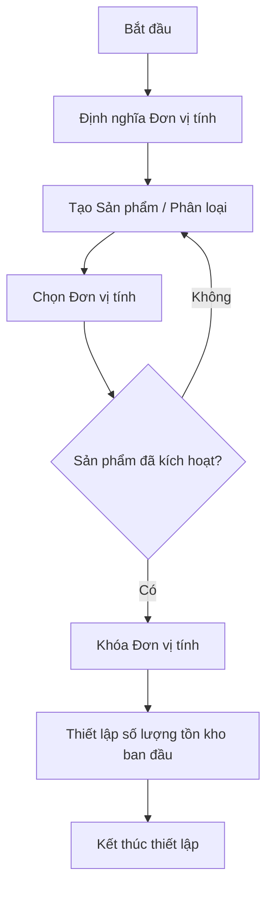
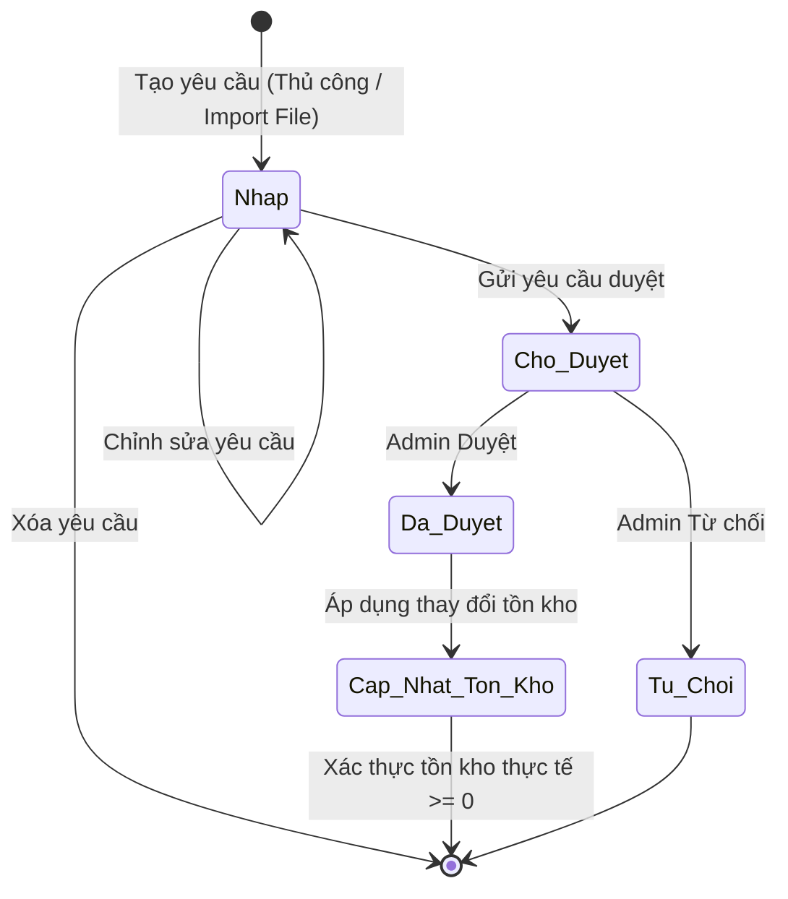
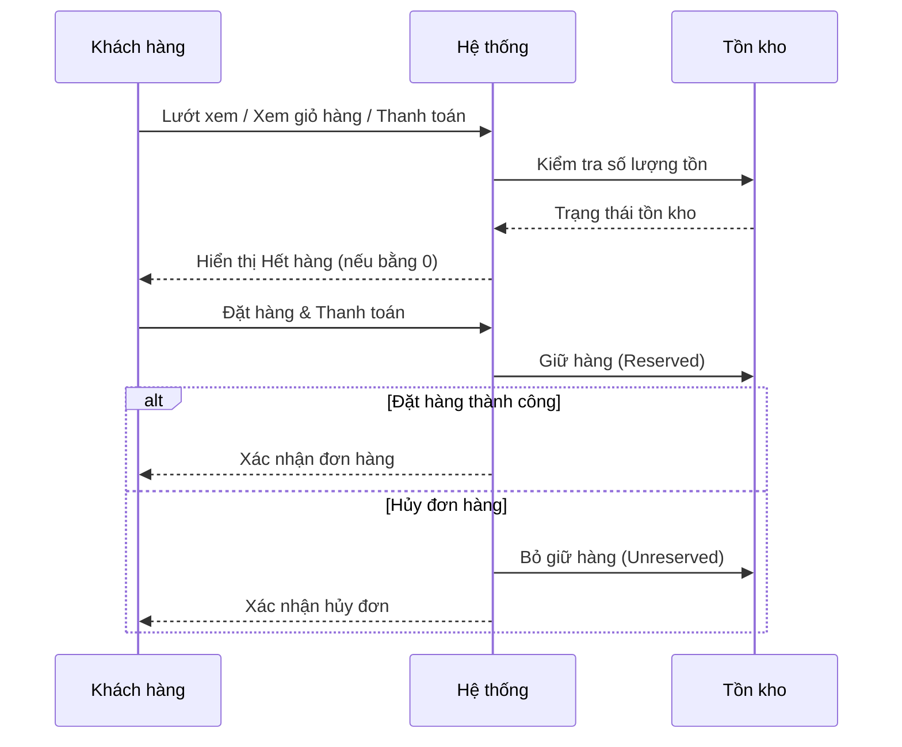
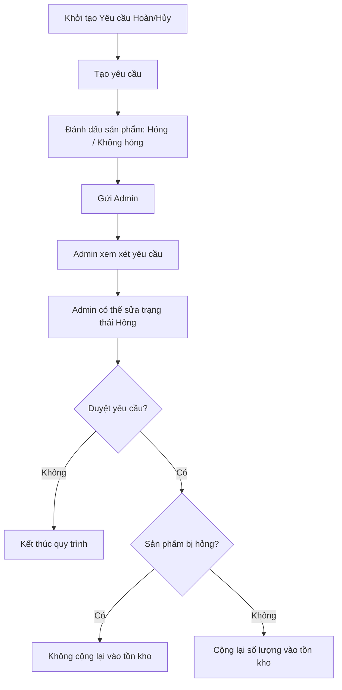

# Sơ đồ Quy trình nghiệp vụ Quản lý tồn kho

Dưới đây là các sơ đồ biểu diễn trực quan các quy trình nghiệp vụ được mô tả trong hệ thống quản lý tồn kho.

## 1. Thiết lập Dữ liệu gốc & Tồn kho ban đầu

## 2. Quy trình Điều chỉnh tồn kho

## 3. Quy trình Đặt hàng & Thanh toán

## 4. Quy trình Trả hàng & Hoàn tiền

